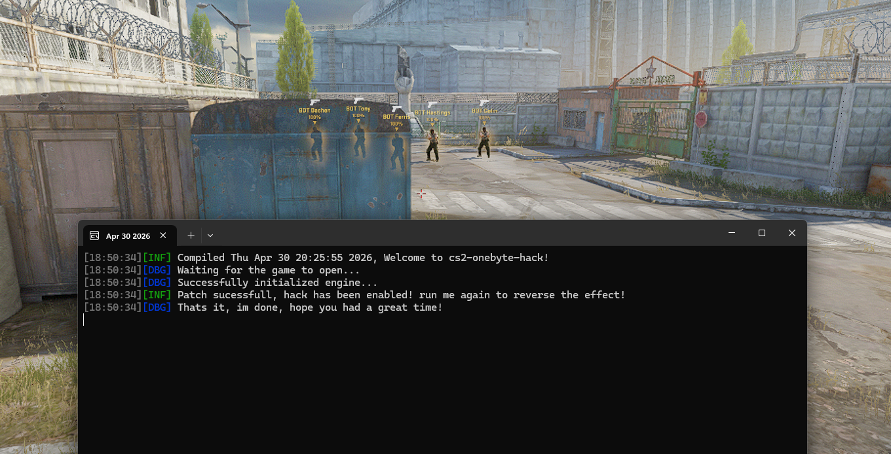

# 🕹️ CS2 Onebyte Hack

Simple onebyte hack, patching just one memory byte to enable cs2 replay glow. Very easy implementation, just open the app once to enable it, memory will patched and should work for the entire session. You can open it again to restore the memory.

> This idea was brought to me by a community member, I'm not the one that discovered this "feature".

## Showcase

> Click the picture below to go to the showcase video

[](https://youtu.be/giFeufea6s8)

## 💡 Important

> [!WARNING]
> This project is provided *'as is'* for learning purposes with no warranties or responsibility from the developers/contributors. Use it at your own risk; you are the only one accountable for your actions

* **Detection Status:** This project is intended solely for single-player use. This project **Writes To Memory**, and might cause integrity checks to raise detection or lower trust factor.
* **Anti-Virus Alerts:** This software may resemble malware in behavior because it accesses other processes memory, so it is commonly flagged by anti‑virus programs. I strongly encourage you to read the source code and build it yourself by following the [developers instructions](#-developer-instructions).

## 🌳 Simple Use

1. You can download it from [**Releases**](./releases) tab or **build it yourself** by following [developers instructions](#-developer-instructions).

2. Open the game & when in menu, open `cs2-onebyte-hack.exe`, and thats it, you can close it now!

3. **⭐ The repository if you like the project!**

## 📘 Developer Instructions

1. Clone repository. Make sure you copy the command below to clone dependencies too

```sh
git clone --recursive https://gitlab.com/IMXNOOBX/cs2-onebyte-hack
```

2. Build the app using **Visual Studio 2026**
	- Build: **`x64 - Release`**

3. Locate your binary file in the folder `<arch>/<configuration>`, e.g., `x64/Release`.

## 💫 Credits

* This method was discovered by a **unknown user** and was brought to me by a **community member**. If you are that person, please contact me to get featured here!

## 🔖 License & Copyright

This project is licensed under [**CC BY-NC 4.0**](https://creativecommons.org/licenses/by-nc/4.0/).

```diff
+ You are free to:
	• Share: Copy and redistribute the material in any medium or format.
	• Adapt: Remix, transform, and build upon the material.
+ Under the following terms:
	• Attribution: You must give appropriate credit, provide a link to the original source repository, and indicate if changes were made.
	• Non-Commercial: You may not use the material for commercial purposes.
- You are not allowed to:
	• Sell: This license forbids selling original or modified material for commercial purposes.
	• Sublicense: This license forbids sublicensing original or modified material.
```

### ©️ Copyright
The content of this project is ©️ by [IMXNOOBX](https://gitlab.com/IMXNOOBX) and the respective contributors. See the [LICENSE.md](LICENSE) file for details.
